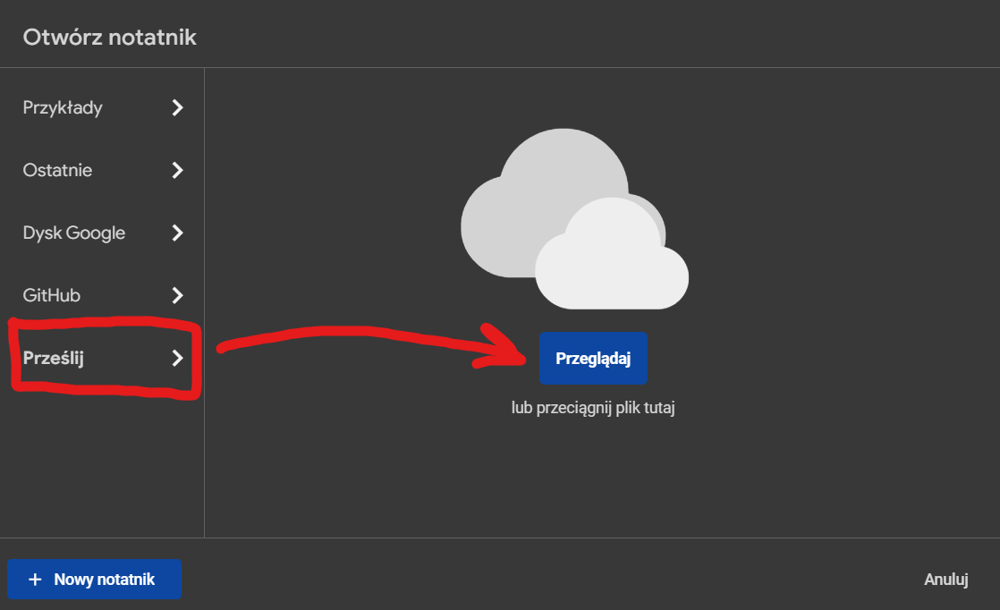
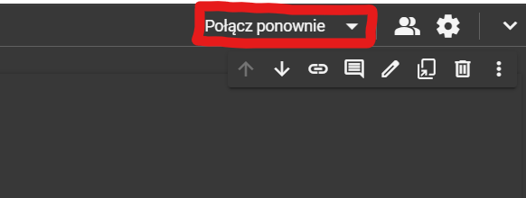
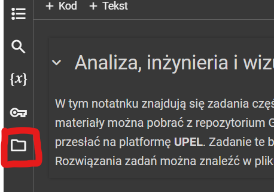
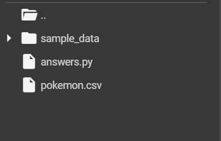

# Inżynieria i wizualizacja danych z pomocą Numpy, Pandas i Matplotlib

Autorzy: Bruno Banaszczyk, Jakub Kogut
Data: 18.04.2024, czwartek 11:30

## Setup

Do rozpoczęcia pracy nie jest wymagana instalacja żadnego oprogramowania. Wszystko co potrzebne jest dostępne w chmurze na platformie [Google Colab](https://colab.research.google.com/). Aby rozpocząć, wykonaj poniższe kroki.

### Pobierz pliki z GitHub

Będąc na stronie naszego repozytorium [GitHub](https://github.com/bingoobongoo/jpwp_projekt), pobierz pliki projektu jako plik **.zip**.

Następnie wypakuj w dogodnym miejscu zawartość folderu. Pliki w nim zawarte będą potrzebne w następnym kroku.

### Ustawienie Google Colab

Przejdź na stronę [Google Colab](https://colab.research.google.com/). Wyświetli się okno z możliwością przesłania plików. Wybierz zakładkę ***prześlij***, a następnie ***przeglądaj***. Przeglądając pobrane pliki odszukaj plik *zadania.ipynb* w folderze *notebooks* i prześlij go.

Teraz powinien się otworzyć notatnik, w którym będziemy pracować. Colab powinien automatycznie połączyć się z chmurą. Sprawdź prawy górny róg notatnika i w razie potrzeby kliknij ***połącz*** lub ***połącz ponownie***. Zielony ptaszek oznacza, że jesteś połączony z chmurą.

Następnie otwórz eksplorator plików w Colab.

 

Ostatnim krokiem jest przesłanie plików z danymi (pliki w folderze *data*) i skryptu sprawdzającego odpowiedzi (plik *answers.py* w folderze *notebooks*). W tym celu otwórz systemowy eksplorator plików, zaznacz i przeciągnij odpowiednie pliki w puste miejsce eksploratora Colab. Powinno to wyglądać tak jak na zdjęciu poniżej.

***GOTOWE!***

## Część praktyczna

Zadania do wykonania oraz wszelkie potrzebne informacje znajdziesz już w notatniku.
